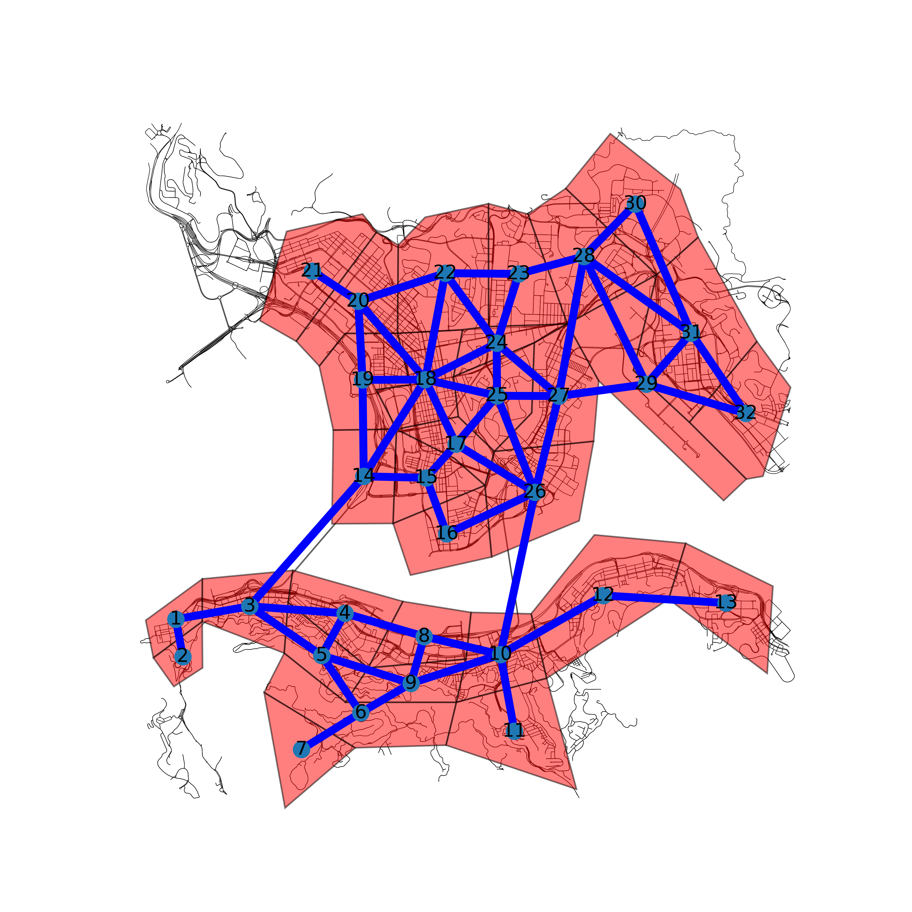

Member of the [Smart Mobility Lab at HKU](https://sites.google.com/view/kejintao/home), Principal Investigator: Dr. Jintao Ke.

Publications
======

  <ul>
    
  </ul>

## Working papers
**Zhang, Kaihang**, Jintao Ke $^*$, Hai Wang, and Yafeng Yin. 2023. "Operational strategy designs for on-demand food delivery services."
- An early version of this work presented as an oral presentation in the 27th International Conference of Hong Kong Society for Transportation Studies.

**Zhang, Kaihang**, and Jintao Ke $^*$. 2023. "Three-sided network equilibrium model of on-demand food delivery services."
- An early version of this work presented as a poster in the 27th International Conference of Hong Kong Society for Transportation Studies.

## Projects During Master's Study
- Air Traffic Demand Forecasting (CE 260/CE 290 Project at UC Berkeley) Using Variational Autoencoder, 2022 Sp
- Public Transportation Ridership Prediction (CE 259 Project at UC Berkely) Using Graph Convolutional Network, 2022 Sp
- Impact of Safty Consideration for Choice of Transportation Modes (CE 264 Project at UC Berkeley), 2022 Sp
- Transit Demand Generation Study (CE 299 Project at UC Berkeley) Using Multilayer Perceptron, 2022 Sp
- A Comparative Study of the Network Partition Algorithms (CE 263N Project at UC Berkeley) (K Means, Louvain, Girvan–Newman), 2021 Fa
- Public Transportation Planning and Optimization Using Continuum Approximation --- A Case Study in the Chicago Area, 2021 Fa
- Short-term Traffic Forecasting Under Data Insufficient Problems Using Transfer Learning, 2021 Fa

## Projects During Undergraduate Study
- Queue Profile Identification at a Signalized Intersection Using Machine Learning Techniques
- Real-time Queue Length Estimation at an Isolated Signalized Intersection Using Kalmen Filter
- CAV Trajectory Optimization for Eco-driving (Using VISSIM-COM)
- Crowd Dynamics (Pedestrian Simulation) for Evacuation Purpose

## Open-Sourced Tools
### Food Delivery System Simulator
- An agent-based model, demo on Hong Kong island (a topological network) and Singapore (real-world geometric road network)
- More details [here](https://khzhang2.github.io/project/FD_simulator/)

### Regional Partitioning Dataset of Hong Kong
- A dataset containing the partitioning data of Hong Kong (vertex coordinates, connectivity, number of restaurants in each region, geometry, etc).
- Collaborated with Mr. Jiadong Ren (summer intern student in 2023)
- More details [here](https://github.com/khzhang2/HK_region_partition)

### 2-D Frame Structure Solver Using the Direct Stiffness Method
- By inputting the external loads and the structure layout, users can obtain the element-end forces of a structure, as well as the resultant forces at each supporting node. The internal moment, shear force, and normal force diagrams of the structure are also shown in the result. Additionally, the nodal displacement is also calculated and the deformed shape is visualized as well.
- Github code [here](https://github.com/khzhang2/Structural_Calculator)
